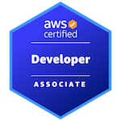

<h1> 
Ryan Rosiak
 </h1>
<h2> 
Software Engineer @ JP Morgan Chase
 </h2>
<h2> 
Tutor - Developer - Mentor
 </h2>
<h2> 
Certifications
 </h2>

  </img>

<h2> 
Language Proficiency
 </h2>

  </img>
  </img>
  </img>
  </img>
  </img>
  </img>
  </img>

<h2> 
Library/Application Knowledge
 </h2>
<ul class="dashed">
  <h3> 
All Purpose
 </h3>
  <ul>
    <li>
Cloud Foundry Applications (Jira, Confluence, Bitbucket)
</li>
    <li>
Github
</li>
    <li>
Debian based linux environment (Bash, CLI)
</li>
    <li>
Unix Shell Scripting
</li>
    <li>
XAML, XML, YAML, and other markup languages
</li>
  </ul>
  <h3> 
Big Data
 </h3> 
  <ul>
      <li>
Hadoop, Hive, PySpark/ScalaSpark, and Yarn
</li>
  </ul>
  <h3> 
Cloud
 </h3>
  <ul>
    <li>
AWS EKS, EC2, EMR, S3, EFS, and Lambda
</li>
    <li>
Docker/Kubernetes
</li>
  </ul>
  <h3> 
Machine Learning
 </h3>
  <ul>
    <li>
Time Series Forecasting
</li>
    <li>
Basic Regression and Classification models
</li>
    <li>
nltk, Numpy, Matplotlib, Pandas, and Seaborn
</li>
    <li>
Jupyter Notebooks
</li>
  </ul>
  <h3> 
Database
 </h3>
  <ul>
    <li>
PostgreSQL, NoSQL, and MySQL
</li>
    <li>
Microsoft Server using Linq
</li>
  </ul>
  <h3> 
Parallel Processing
 </h3>
  <ul>
    <li>
Openmpi3 and MPICH3
</li>
  </ul>
  <h3> 
Cybersecurity
 </h3>
  <ul>
    <li>
Nmap, Burpsuite, and Metasploit
</li>
  </ul>
  <h3> 
Web/Mobile Dev
 </h3>
  <ul>
    <li>
React Native and React (Mobile Development)
</li>
    <li>
HTML, CSS, and Javascript
</li>
    <li>
Spring Core, Boot, Maven, and MVC
</li>
    <li>
Flask
</li>
  </ul>
</ul>
  
  
</ul>
<h2> 
About Me
 </h2>

I have just recently graduated from Salisbury University and have started working as a full time software engineer at JP Morgan Chase.
  I am currently a python developer working with Spark, Hadoop, and AWS cloud technologies. I am very interested in a wide variety of fields including
  machine learning, big data, cloud, cybersecurity, and systems software. Some side projects that I have been working on can be viewed below. 
  See my <a href="http://spa542.pythonanywhere.com/index.html">portfolio</a> to view and download current/ongoing projects.

<h2> 
Current Projects:
 </h2>
<ol>
  <li>
Keep In Contact Email Bot
</li>
  <li>
Creating a single node Hadoop/Hive/Pyspark cluster
</li>
  <li>
Continuing app development for MusicTown Live (Source: <a href="https://apps.apple.com/us/app/musictown-live-find-live-music/id1217586564">Apple</a> - <a href="https://play.google.com/store/apps/details?id=com.musiqueliveapp&hl=en_US&gl=US">Android</a>)
</li>
  <li>Exploring cybersecurity and mainframe topics</li>
  <li>
Refactoring entire portfolio website</p</li>
  <li>
Updating project <a href="https://github.com/spa542/HonorSocietiesDB">HonorSocietesDB</a> for university
</li>
  <li>
Pathfinding/Graph Algorithm Visualizer
</li>
</ol>
<!--
**spa542/spa542** is a ✨ _special_ ✨ repository because its `README.md` (this file) appears on your GitHub profile.

Here are some ideas to get you started:

- 🔭 I’m currently working on ...
- 🌱 I’m currently learning ...
- 👯 I’m looking to collaborate on ...
- 🤔 I’m looking for help with ...
- 💬 Ask me about ...
- 📫 How to reach me: ...
- 😄 Pronouns: ...
- ⚡ Fun fact: ...
-->
