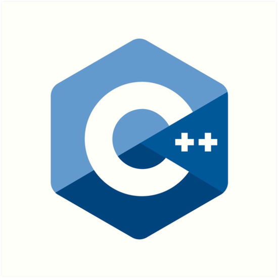
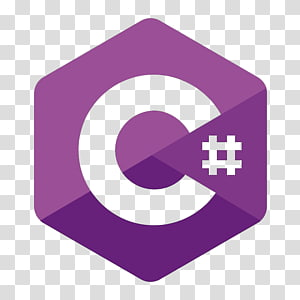

<h1> 
Ryan Rosiak
 </h1>
<h2> 
Software Engineer Intern - Student Tutor - Programmer
 </h2>
<h2> 
Language Proficiency
 </h2>

  </img>
  </img>
  </img>
  </img>
  </img>

<h2> 
Other Library/Application Knowledge
 </h2>
<ul>
  <li>
Numpy, Matplotlib, Pandas, and Seaborn
</li>
  <li>
Jupyter Notebooks
</li>
  <li>
PHP
</li>
  <li>
Spring Core, Boot, Maven, MVC, REST, and Hibernate
</li>
  <li>
Microsoft Server using Linq
</li>
  <li>
Basic XAML, HTML, CSS, and Javascript
</li>
  <li>
Flask
</li>
  <li>
PostgreSQL and MySQL
</li>
  <li>
Openmpi3 and MPICH3
</li>
</ul>
<h2> 
About Me
 </h2>

Currently, I have just started my internship at JP Morgan Chase as a Software Engineer working in Consumer and Community Banking. My team and I are working on a JIRA bot using machine learning techniques and python. This summer I will also be working on some side projects (see below) when I am not busy with my internship.
 <a href="http://spa542.pythonanywhere.com/index.html">portfolio</a>.

<h2> 
Current Classes:
 </h2>
<ul>
  <li>
COSC 450 - Operating Systems
</li>
  <li>
COSC 425 - Software Engineering 1
</li>
  <li>
DSCL 470 - Research Methods in Data Science
</li>
  <li>
COSC 380 - Internship Presentation
</li>
</ul>
<h2> 
Current Projects:
 </h2>
<ol>
  <li>
Updating project <a href="https://github.com/spa542/HonorSocietiesDB">HonorSocietesDB</a> for school production
</li>
  <li>
Pathfinding/Graph Algorithm Visualizer
</li>
  <li>
Beginning Design MatchMyMunchies
</li>
  <li>
Building web apps in Spring and applying current Java knowledge
</li>
  <li>
Refactoring entire portfolio website
</ol>
<!--
**spa542/spa542** is a ✨ _special_ ✨ repository because its `README.md` (this file) appears on your GitHub profile.

Here are some ideas to get you started:

- 🔭 I’m currently working on ...
- 🌱 I’m currently learning ...
- 👯 I’m looking to collaborate on ...
- 🤔 I’m looking for help with ...
- 💬 Ask me about ...
- 📫 How to reach me: ...
- 😄 Pronouns: ...
- ⚡ Fun fact: ...
-->
